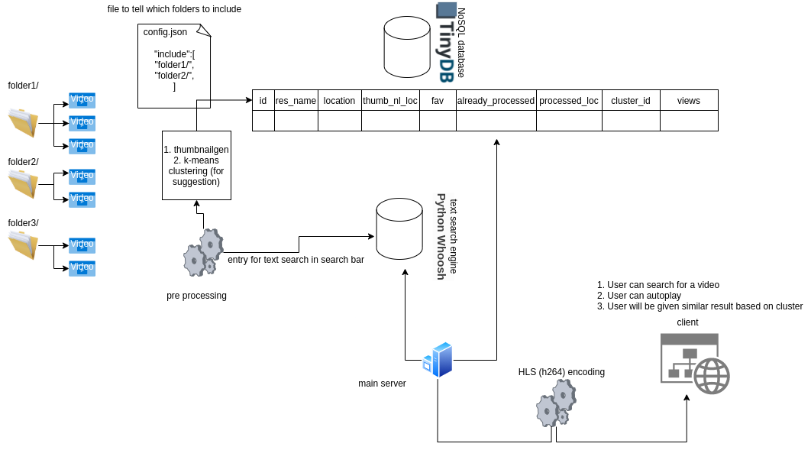

## MyTube
A video server service local video files over local internet using HLS protocol along with many capabilities like searching using test search engine etc.

## How this works
1. First step is to edit the `config.json` file. One needs to add the video directories to include. This file is not there, app should be run atleast one to generate this file.
```
{
  "version": "1.0.0",
  "vide_directory_absolute": [
    <video directory 1>
    <video directory 2>
  ],
  "max_HLS_folder_size_GB": 1.0
}
```
There maybe other files than video, one can determine file type using the `mimetype` or the `extension` of the file. The extensions are mentioned in `Constants.ACCEPT_FILE_FORMATS`
2. One the `paths` are added, program calculated the `Md5` hash of each file. Whenever the server starts, it also creates a `config-lock.json` to preserver the last know `image` of `config.json` along with hash.
Delete `config-loc.json` if one wants to reset everything.
Program then calculates the `diff` namely 

   1. which files should be removed from indexing (db & text search engine) -- files removed by user
   2. Which files should be inserted as a new file
   3. which files should be renamed (Md5 hash same, maybe video renamed or moved by user)


3. For database [TinyDB](https://tinydb.readthedocs.io/en/latest/index.html) is used and for text search [Whoosh](https://whoosh.readthedocs.io/en/latest/intro.html) is used. The data structure for the database is like
```
{'id': file_id,
 'file_name': ,
 'abs_path': ,
 'thumbnail_path': ,
 'duration': ,
 'width': ,
 'height': ,
 'format_name': ,
 'size': ,
 'v_bitrate': ,
 'a_bitrate': ,
 'is_favourite': ,
 'hls_processing': ,
 'hls_already_processed': ,
 'hls_process_location': ,
 'cluster_id': ,
 'views': 
 }
```
4. After updating the indexes, `Thumbnails` are generated for the required files using [ffmeg](https://ffmpeg.org/download.html). make sure `ffmpeg` installed on the system. and stored in `Constants.THUMBNAIL_FOLDER_PATH`
5. Once it is done, server is ready to accept the requests.
6. Once a request if `GET`, server checks if the `<file_name>.m3u8` available inside `Constants.HLS_OUTPUT_PATH` or not.
If not it will start a `new process` to process the file and deliver the chunks to client accordingly.


Once processed, the next time the buffering will be low. Buffering can be also be affected by the resolution during conversion. This app is using deafult `Representation(Size(640, 360), Bitrate(276 * 1024, 128 * 1024))`

---
## Architecture


---

## Installing
1. Make sure [ffmeg](https://ffmpeg.org/download.html) is installed. I worked with Ubuntu, hope will work fine with windows als well.
2. Create virtual env `python -m venv venv`
3. Activate it ex: in ubuntu `source ./venv/bin/activate`
4. Install the required packages `pip install -r requirements.txt`
5. Start `python app.py`

I have not used any proper servers, it worked fine with Flask-test server for personal project, one can use `gunicorn`.